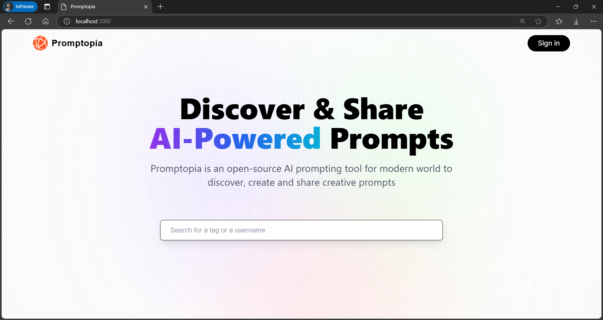

## Introduction

This project is a Next.js application that demonstrates the core features of Next.js while implementing a comprehensive CRUD AI prompt-sharing system. The application uses MongoDB for the database and NextAuth for authentication.

## Tech Stack

- Next.js
- MongoDB
- NextAuth
- TailwindCSS

## Features

- **Modern Design with Glassmorphism Style**: A sleek and contemporary design using the glassmorphism trend.
- **AI Prompt Sharing**: Users can discover and share AI prompts created by the community.
- **Edit and Delete Prompts**: Users have the ability to edit or delete their own prompts.
- **Profile Pages**: Each user has a profile page showcasing the prompts they’ve created.
- **Profile Exploration**: Users can explore other creators' profiles and prompts.
- **Copy to Clipboard**: A feature for users to easily copy AI prompts for their use.
- **Tag-based Search**: Users can search for prompts by specific tags.
- **Google Authentication with NextAuth**: Secure Google authentication for login.
- **Responsive Design**: Fully responsive website to ensure an optimal experience across devices.

#### Note
- You need to create a .env file in the root with all the credentials for the google cloud consol and MongoDB.
 
- Kudos to Adrian for the idea.
